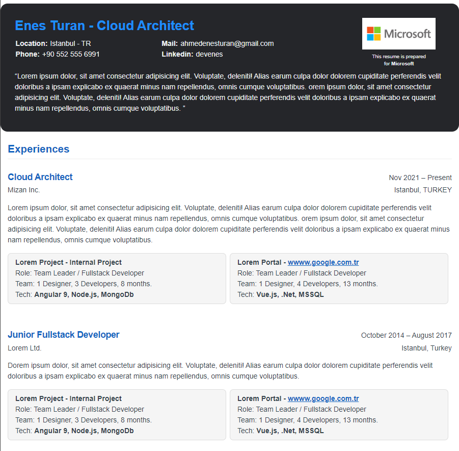

# CV Template

- You can use this template to create your CV.
- You can change the template for your CV.
- You can add your own information.
- You can add the picture of the company that you applied to.
- You can change the picture in the template for your CV by changing the image in the `CV Template` folder.
- You can create a PDF version of your CV by saving the file as a PDF.
